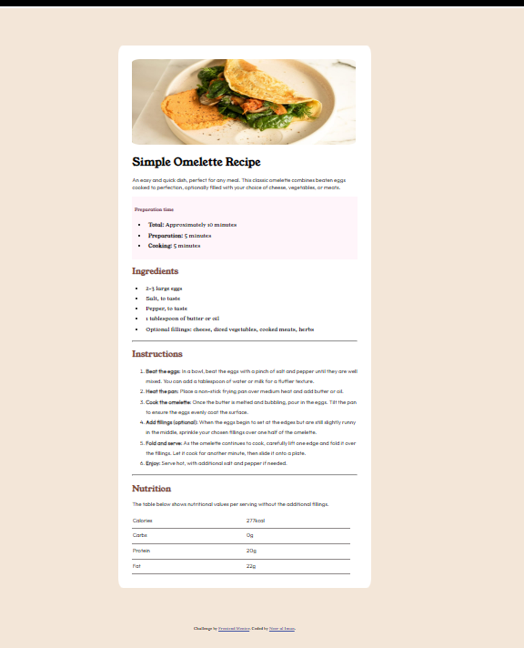

# Frontend Mentor - Recipe page solution

This is a solution to the [Recipe page challenge on Frontend Mentor](https://www.frontendmentor.io/challenges/recipe-page-KiTsR8QQKm). Frontend Mentor challenges help you improve your coding skills by building realistic projects. 

## Table of contents

- [Overview](#overview)
  - [The challenge](#the-challenge)
  - [Screenshot](#screenshot)
  - [Links](#links)
- [My process](#my-process)
  - [Built with](#built-with)
  - [What I learned](#what-i-learned)
  - [Continued development](#continued-development)
  - [Useful resources](#useful-resources)
- [Author](#author)
- [Acknowledgments](#acknowledgments)

## Overview
Here's the complete code of teh REcipe page. All stylings ccording to the sample image.

### Screenshot

here's the screenshot of the complete page.

### Links

- Solution URL: [Add solution URL here](https://your-solution-url.com)
- Live Site URL: [Add live site URL here](https://your-live-site-url.com)

## My process

### Built with

- Semantic HTML5 markup
- CSS custom properties
- Flexbox
- CSS Grid

### Continued development

I'm not familiar with the stylings, width-setting to make page responsive for mobile screen also. Hope someone can help me out on that.

## Author

- Website - [Noor ul Iman](https://github.com/no123or/Basic-frontend-projects/tree/main/recipe-page-main)
- Frontend Mentor - [Noor Iman](https://www.frontendmentor.io/profile/no123or)
- Instagram - [noorayyyys_canvas]()

